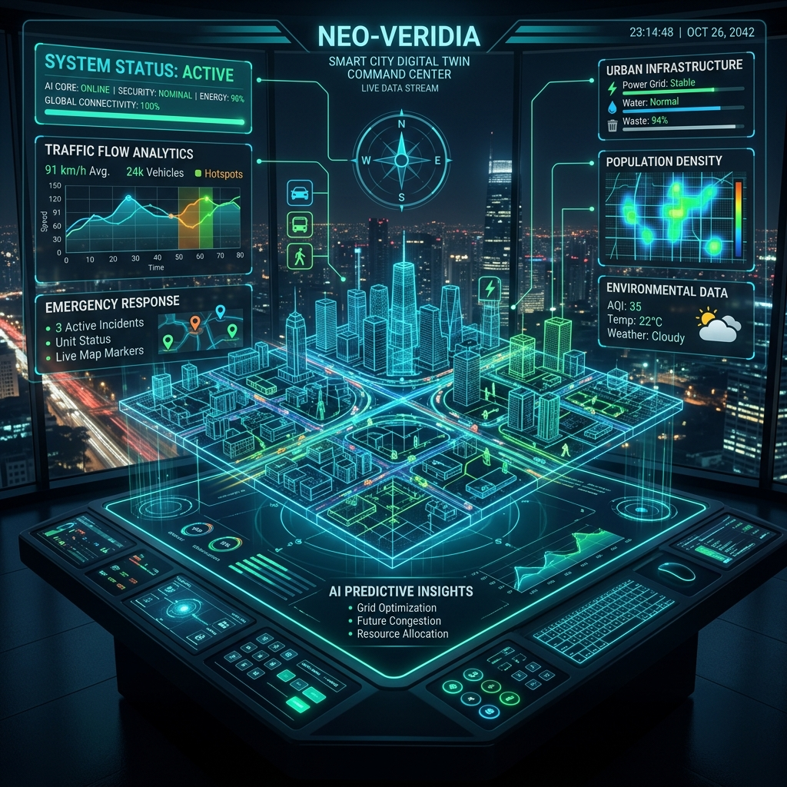

# 🏙️ CityTwin AI — Kochi Command Center

CityTwin AI (Sentinel AI) is a next-generation, high-performance **Smart City Command Center and Digital Twin Dashboard** for Kochi, Kerala. It combines real-time sensor simulation, Vision AI surveillance analytics, and multi-agent AI reasoning to monitor, simulate, and optimize urban infrastructure.




---

## ✨ Features

- **🌐 Interactive Digital Twin Map**: Live Mapbox-powered dashboard overlay displaying sensor grids, transit routes, and pulsing incident pins categorized by severity (Critical, Warning, Info).
- **📹 Vision AI CCTV Monitoring**: Simulated real-time object detection stream (cars, buses, trucks, pedestrians) that automatically flags road obstructions, accidents, and lane blockages.
- **💬 Sentinel AI Copilot**: A multi-agent AI chat assistant powered by **Google Gemini API** (with local fallback) to query city status, trigger emergency responses, and perform smart calculations.
- **🚦 Smart Traffic Optimization**: Live queue tracking and signal phase scheduling, featuring priority lane overrides for emergency vehicles.
- **🌊 Flood Monitoring & Prediction**: Dynamic water level sensors, flood danger zone mapping, and predictive risk meters based on weather triggers.
- **📊 Executive Reports Generator**: Auto-compiles live operational statistics, incident histories, and resolution metrics into downloadable executive summaries.
- **🚇 Smart Transit Tracker**: Moniting live updates from the Kochi Metro, Water Metro, and public bus networks.
- **🎮 Disaster Simulation Sandbox**: An interactive control board to stress-test the city by simulating extreme rainfall, peak traffic congestion, or sudden road blockages.

---

## 🛠️ Technology Stack

- **Framework**: [TanStack Start](https://tanstack.com/router/v1/docs/start/overview) (React 19 + Vite + Nitro Server Engine)
- **Styling**: [Tailwind CSS v4](https://tailwindcss.com/) & Vanilla CSS for premium dark-themed glassmorphic UI components
- **Animations**: [Framer Motion](https://www.framer.com/motion/) & CSS keyframes for fluid, interactive micro-transitions
- **Charts & Data**: [Recharts](https://recharts.org/) for real-time traffic and flood analytics
- **Icons**: [Lucide React](https://lucide.dev/)
- **State Management**: [Zustand](https://github.com/pmndrs/zustand)

---

## 🚀 Getting Started

### Prerequisites

Make sure you have [Node.js](https://nodejs.org/) (v18 or higher) installed.

### Installation

1. Clone or download the repository:
   ```bash
   git clone <repository-url>
   cd sentinel-ai-main
   ```

2. Install the dependencies:
   ```bash
   npm install
   ```

3. Set up the environment variables:
   - Copy `.env.example` to `.env`:
     ```bash
     cp .env.example .env
     ```
   - (Optional) Add your Google Gemini API key to enable the AI Copilot:
     ```env
     VITE_GEMINI_API_KEY="your_api_key_here"
     ```

### Run Locally

Start the local development server:
```bash
npm run dev
```
Open your browser and navigate to **`http://localhost:8081/`** (or the port specified in your console).

---

## ☁️ Deployment on Vercel

CityTwin AI is built using TanStack Start and Nitro, meaning it supports **Vercel** out-of-the-box with zero extra configuration.

### Deployment Steps:

1. **Push to GitHub**:
   Initialize a git repo, commit the files, and push them to your GitHub repository.

2. **Import to Vercel**:
   - Go to [Vercel Dashboard](https://vercel.com/new).
   - Import your GitHub repository.
   - Vercel will automatically detect the **TanStack Start** framework preset.

3. **Configure Environment Variables (Optional)**:
   Add your Gemini API Key in Vercel settings under **Environment Variables**:
   * `VITE_GEMINI_API_KEY` = `your_gemini_api_key`

4. **Click Deploy**:
   Vercel will build and deploy the application. It will automatically route server-side functions and assets.

---

## 📄 License

This project is licensed under the MIT License.
